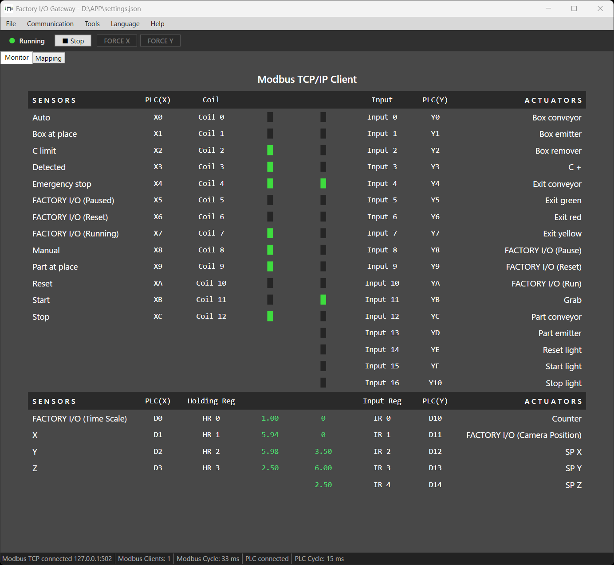

# Factory I/O SLMP / Host Link Gateway

[](https://github.com/fa-yoshinobu/factoryio-slmp-hostlink-gateway/releases)
[](LICENSE)




This gateway connects the Factory I/O `Modbus TCP/IP Client` driver to a real PLC.

- Factory I/O connects to this application as a Modbus TCP client.
- The gateway connects to the PLC by `SLMP` or `KEYENCE Host Link`.
- Coil / HR values are written from Factory I/O to the PLC.
- DI / IR values are read from the PLC and returned to Factory I/O.

## Quick Start

1. Start `FactoryIOGateway.exe`.
2. Open `Communication` -> `PLC Communication Settings` and set the PLC connection.
3. Open `Communication` -> `Modbus Communication Settings` and set the IP / Port / Unit ID that Factory I/O will use.
4. Export the tag CSV from Factory I/O.
5. Open `File` -> `Factory I/O Tag CSV Import` and import the CSV.
6. Enter PLC addresses in `Mapping`, for example `M0` or `D0`.
7. If needed, use `Tools` -> `Bulk Assign PLC Addresses` to assign PLC addresses in sequence.
8. Save the settings with `File` -> `Save As...`.
9. In Factory I/O, select the `Modbus TCP/IP Client` driver and connect to the gateway.
10. Click `Start` to begin communication.
11. Use `Monitor` to check values and logs.

The application starts with empty settings. To use saved settings, load them first with `File` -> `Load Settings...`.

The UI starts in English every time. You can temporarily switch the UI language from the `Language` menu.

## Factory I/O Settings

In Factory I/O `Modbus TCP/IP Client`, enter the same values as the gateway Modbus communication settings.

| Factory I/O | Gateway |
|---|---|
| Host | IP address of the PC running the gateway |
| Port | Port in `Modbus Communication Settings` |
| Unit ID | Unit ID in `Modbus Communication Settings` |

Default values:

| Item | Value |
|---|---|
| Listen IP | `127.0.0.1` |
| Port | `502` |
| Unit ID | `1` |

If Factory I/O is running on another PC, `127.0.0.1` cannot be used as the gateway listen IP. Use the LAN IP address of the gateway PC, or `0.0.0.0`. The target TCP port must also be allowed through Windows Firewall.

### Factory I/O Driver Setup

In Factory I/O:

1. Open the `Driver` menu.
2. Select `Modbus TCP/IP Client`.
3. Assign the required I/O points.
4. If you use the `Float` data type, set `Scale` in `CONFIGURATION`.
5. Check the multiplier because `Float` values are converted to integer values. The default `100` is usually fine.
6. If you change the Factory I/O `Scale`, change the FactoryIOGateway Modbus `Scale` to the same value.
7. If there are not enough I/O points, increase `Count` in `I/O Points`.
8. Keep `Offset` set to `0`.
9. When setup is complete, select `Tag Export` at the bottom right.
10. Import the exported CSV file into this tool.

## PLC Simulator Settings

### GX Simulator 3

For SLMP communication with GX Simulator 3, use the following connection settings.

| Item | Value |
|---|---|
| IP | `127.0.0.1` |
| Port | `5511` |
| Transport | TCP |

The following parameter must be enabled:

- `Enable/Disable Online Change: Enable All (SLMP)`

Available models:

- iQ-R / iQ-L only

Verified environment:

- GX Works3 Version 1.125F

### KV STUDIO(Simulator)

For Host Link communication with KV STUDIO(Simulator), use the following connection settings.

| Item | Value |
|---|---|
| IP | `127.0.0.1` |
| Port | `8501` |
| Transport | TCP |

Available models:

- KV-X310/X500/X520/X530/X550 profile family and KV-8000/KV-8000A profile family, with or without XYM notation

Verified environment:

- KV STUDIO Ver.12.41

## PLC Auto Reconnect

PLC communication settings include `Auto reconnect PLC`, which is enabled by default.

When the PLC connection is lost while the gateway is running:

- The Modbus TCP server keeps listening so Factory I/O can stay connected.
- The PLC status changes to reconnecting and the gateway retries with backoff from 1 second up to 30 seconds.
- DI / IR values keep the last values read from the PLC while the PLC is disconnected.
- Coil / HR write snapshots are cleared when the PLC connection is lost, so current Factory I/O values are written again after reconnect.
- FORCE during reconnect updates the Modbus-side value and logs that the PLC write was skipped until reconnect.

Disable `Auto reconnect PLC` if a PLC communication error should stop the whole gateway immediately.

## PLC Profile Selection

For SLMP, choose the profile that matches the PLC CPU and Ethernet route.
The selector shows canonical display names while saved settings store the
canonical profile value.

| UI label | Canonical profile |
|---|---|
| MELSEC iQ-R (built-in) | `melsec:iq-r` |
| MELSEC iQ-R (RJ71EN71) | `melsec:iq-r:rj71en71` |
| MELSEC iQ-F (built-in) | `melsec:iq-f` |
| MELSEC iQ-L (built-in) | `melsec:iq-l` |
| MELSEC MX-R (built-in) | `melsec:mx-r` |
| MELSEC MX-F (built-in) | `melsec:mx-f` |
| MELSEC-L (built-in) | `melsec:lcpu` |
| MELSEC-L (LJ71E71-100) | `melsec:lcpu:lj71e71-100` |
| MELSEC QnU (built-in) | `melsec:qnu` |
| MELSEC QnU (QJ71E71-100) | `melsec:qnu:qj71e71-100` |
| MELSEC QnUDV (built-in) | `melsec:qnudv` |
| MELSEC QnUDV (QJ71E71-100) | `melsec:qnudv:qj71e71-100` |
| MELSEC-Q (QJ71E71-100) | `melsec:qcpu:qj71e71-100` |

`MELSEC-Q (base profile)` is not a selectable standalone SLMP connection
profile. Use `MELSEC-Q (QJ71E71-100)` when connecting through a QJ71E71-100
Ethernet unit.

For KEYENCE Host Link, choose the profile family that matches the KV model and address notation.
The selector shows canonical display names while saved settings store the
canonical profile value.

| UI label | Canonical profile |
|---|---|
| KEYENCE KV-NANO | `keyence:kv-nano` |
| KEYENCE KV-NANO (XYM) | `keyence:kv-nano-xym` |
| KEYENCE KV-3000 | `keyence:kv-3000` |
| KEYENCE KV-3000 (XYM) | `keyence:kv-3000-xym` |
| KEYENCE KV-5000 | `keyence:kv-5000` |
| KEYENCE KV-5000 (XYM) | `keyence:kv-5000-xym` |
| KEYENCE KV-7000 | `keyence:kv-7000` |
| KEYENCE KV-7000 (XYM) | `keyence:kv-7000-xym` |
| KEYENCE KV-8000 | `keyence:kv-8000` |
| KEYENCE KV-8000 (XYM) | `keyence:kv-8000-xym` |
| KEYENCE KV-X500 | `keyence:kv-x500` |
| KEYENCE KV-X500 (XYM) | `keyence:kv-x500-xym` |

## Mapping Notes

Rows with an empty PLC address are not used for communication. Enter normal PLC device addresses such as `X4`, `Y0`, or `D0`; the gateway uses the row type and display type for interpretation.

| Modbus Type | Direction | Display Type |
|---|---|---|
| Coil | Factory I/O -> PLC | Bool only |
| Holding Register | Factory I/O -> PLC | Int / Float |
| Discrete Input | PLC -> Factory I/O | Bool only |
| Input Register | PLC -> Factory I/O | Int / Float |

The direction is fixed by the Modbus type. It cannot be selected in the Mapping view.

`PLC(X)` means the side from Factory I/O to the PLC. `PLC(Y)` means the side returned from the PLC to Factory I/O.

## CSV Import

When a Factory I/O tag CSV is imported, the gateway applies Modbus addresses and comments to `Mapping`.

- New rows are added.
- Existing rows only update the comment and display type.
- Existing PLC addresses are not overwritten.
- Existing rows that are not in the CSV are not deleted.
- Rows with an empty or unsupported Data Type are skipped.

Supported Data Type values:

| CSV | Mapping |
|---|---|
| `Bool` | Bool |
| `Int`, `Int16`, `Integer` | Int |
| `Real`, `Float` | Float |

## Bulk Assign PLC Addresses

`Bulk Assign PLC Addresses` assigns sequential PLC addresses to the selected Modbus type.
Generated addresses use the same PLC address format shown in the mapping table.

Available devices:

| Protocol | Coil / DI | HR / IR |
|---|---|---|
| SLMP | `X`, `Y`, `M`, `L`, `B` | `D`, `W`, `R`, `ZR` |
| Host Link | `R`, `B`, `MR`, `LR`, `X`, `Y`, `M`, `L` | `DM`, `EM`, `FM`, `ZF`, `W`, `D`, `E`, `F` |

Notes:

- SLMP iQ-F `X/Y` addresses increment as octal.
- Host Link `R/MR/LR` uses KEYENCE bit-bank notation. For example, the next address after `R015` is `R100`.
- Host Link `X/Y` uses a final bit digit of `0..F`.
- The increment is always `1`.

## Monitor and Force

`Monitor` is used while communication is running.

- Normal values are green.
- Force values are orange.
- Hover over a register value to check the raw integer value.

Force behavior:

| Button | Target | Behavior |
|---|---|---|
| FORCE X | Coil / HR | Fixes the value written to the PLC |
| FORCE Y | DI / IR | Fixes the value returned to Factory I/O |

When Force is enabled, the current value is copied into the Force value.

## Int / Float / Scale

PLC and Modbus register values are 16-bit integers.

- `Int` is displayed as a signed 16-bit integer.
- `Float` is displayed by dividing the integer value by `Scale`.
- Values written to the PLC and Modbus remain integer values.
- Only Force input is converted from the displayed value to the integer value.

Examples:

| Scale | Integer Value | Display |
|---:|---:|---:|
| 100 | 1000 | 10.00 |
| 100 | -1000 | -10.00 |
| 10 | 1000 | 100.00 |

## Logs

Use `Tools` -> `Show Log` to check errors and communication status.

- Use `Copy` to copy one row.
- Use `Copy All` to copy all displayed logs.
- Use `Clear Log` to clear the displayed logs and `gateway.log`.

Log files are written to the same folder as the executable:

```text
gateway.log
error.log
```

`gateway.log` and `error.log` rotate to `.1` when they exceed 10 MB so long-running sessions do not grow the files without bound.

## Troubleshooting

Factory I/O cannot connect:

- Check that the Factory I/O Host / Port / Unit ID match the gateway settings.
- If connecting from another PC, the gateway listen IP cannot be `127.0.0.1`.
- Allow the TCP port through Windows Firewall.
- If port `502` cannot be used, change it to another port.

Cannot write to the PLC:

- Check that communication is running.
- Check that the PLC address is not empty.
- Only Coil / Holding Register values are written to the PLC.
- Check Force logs and PLC value mismatch warnings in `Show Log`.

Float display is different from the expected value:

- Check `Scale`.
- When `Scale=100`, integer value `1000` is displayed as `10.00`.
- PLC and Modbus values are integer values. Only the display is divided by `Scale`.

## Documentation

- [Changelog](CHANGELOG.md)
- [TODO](TODO.md)
- [Maintainer notes](docs/maintainer-notes.md)

## Used Libraries

| Library | Version | Purpose |
|---|---:|---|
| CommunityToolkit.Mvvm | 8.4.2 | ObservableObject and RelayCommand support |
| CsvHelper | 33.1.0 | Factory I/O tag CSV parsing |
| NModbus | 3.0.83 | Modbus TCP slave/server |
| PlcComm.Slmp | 1.2.0 | MELSEC SLMP PLC read/write |
| PlcComm.KvHostLink | 1.2.0 | KEYENCE Host Link PLC read/write |

## License

MIT License. See `LICENSE` for details.
